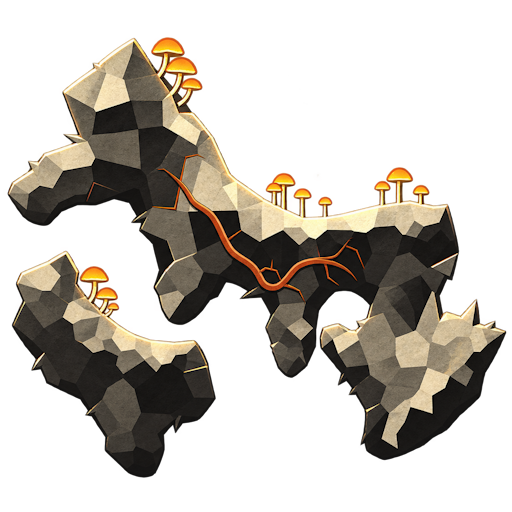

# ebiten-infinicave



A Go library for an infinite procedural cavern with faceted rock, branching vines, and mushrooms, rendered with Ebitengine. Choose a fixed vertical or horizontal scrolling orientation: the world grows upward from a bottom edge or rightward from a left edge. Terrain is generated in the background and nearby sections are cached; returning to an evicted area regenerates the same rocks and vines from its seed and orientation.

The root package is `infinicave`; the interactive viewer and PNG exporter live in
`cmd/infinicave`. The library leaves your game loop, input, camera, window settings,
and UI under your control.

See [the architecture guide](docs/architecture.md) for package ownership, file
navigation, and the generation/rendering lifecycle.

Import it as `github.com/razzie/ebiten-infinicave`:

```sh
go get github.com/razzie/ebiten-infinicave
```

Create a scene once and close it when your game exits:

```go
config := infinicave.DefaultConfig()
config.Seed = 42
scene, err := infinicave.NewScene(config)
if err != nil {
    return err
}
defer scene.Close()
```

Keep `scene` in your own `ebiten.Game`. In `Update`, advance your camera and call
`scene.Update(viewport)` once per tick. In `Draw`, call `scene.Draw(screen, viewport)`.
For example, a stationary view of the bottom square section uses:

```go
viewport := infinicave.Viewport{Y: -1, Height: 1}
ready := scene.Update(viewport) // false while required sections are loading
scene.Draw(screen, viewport)
// Add your own loading UI when !ready.
```

The cave is `infinicave.Width` (1 scene unit) wide. Each section is a square,
with its owned local area running from `(0, 0)` to `(1, 1)`;
`infinicave.SectionHeight` is also 1. World Y is negative above the floor at zero,
so the initial viewport Y is `-viewport.Height` and scrolling upward decreases it.
Section IDs follow that direction: `0` at the bottom, then `-1`, `-2`, and so on
upward. Section `id` owns the world band from Y = `id-1` to Y = `id`.
`Viewport.Height` is a floating-point height in scene units, and
`Viewport.Velocity` is camera movement in scene units per tick for directional
prefetching. Y must be finite and no greater than `-viewport.Height`; height must
be finite and positive. Invalid viewports do no work and report not ready.

Set `Config.Orientation = infinicave.Horizontal` before `NewScene` for horizontal
scrolling. The cave is then one scene unit high, occupies X >= 0 and Y from 0 to 1,
and grows rightward. IDs remain single integers: `0` at the left edge, then `-1`,
`-2`, and so on; section `id` owns X from `-id` to `-id+1`. Horizontal viewports
use `X` and `Width`, with finite X >= 0 and finite Width > 0. Their velocity is
movement along world X, with positive values moving rightward. For example:

```go
config := infinicave.DefaultConfig()
config.Orientation = infinicave.Horizontal
scene, err := infinicave.NewScene(config)
if err != nil {
    return err
}
defer scene.Close()
viewport := infinicave.Viewport{X: 0, Width: 1.6}
scene.Update(viewport)
scene.Draw(screen, viewport)
```

Orientation stays fixed through `Reset`. Each orientation is deterministic, but
the same seed can produce different layouts in the two modes. Guides favor
horizontal ledges, mushrooms grow upward, and lighting comes from above and left
in both. Vines retain world-oriented growth preferences. Horizontal foreground
cutoffs and background margins run across the top and bottom; bats cross vertically.

Rendering uses `min(width, height)` pixels per scene unit. Landscape targets
show a centered 1 × 1 cave; portrait targets retain their full width. Set
`Viewport.Height` to `height / min(width, height)`: for example, a 1000 × 800
image uses height 1, and a 500 × 800 image uses height 1.6. Background Voronoi
cells and fog extend from X = −0.5 to 1.5, fading smoothly across the side
margins. Bats cross this extended area and fade near its edges. Hover and
carving coordinates follow the centered cave.
These are the vertical-scrolling rules. In horizontal scenes, the cave centers
vertically, `Viewport.Width` is `width / min(width, height)`, and the extended
background and fog occupy Y = −0.5 to 1.5. Camera movement, queries, carving,
collision callbacks, and fetched geometry all use ordinary world X/Y.
Generation, spatial fields, and collision calculations use scene units throughout.
Only mesh preparation and rendering convert coordinates to pixels. Set
`scene.SetRenderWidth(min(nativeWidth, nativeHeight))` before `Update` to rasterize cached textures
at the native cave width; the default is 1000 pixels per scene unit. Resizing
reuses prepared meshes, queries, and runtime cuts. Sections contributing to the
viewport refresh first; offscreen images refresh when they become visible.

The viewer implements hover locally using `Query`, `Formation`, and `Guide`;
applications can use the same APIs to draw their own selection effects.
`scene.Reset(seed)` discards cached sections and starts a new
world with the same rendering settings, section content loader, and collision callback. Rendering does not include UI or exports.
Call every `Scene` method on the Ebitengine game goroutine. `Close` is idempotent
and releases shaders and cached images; background generation stops at its next cancellation check
before its workers exit.

`DefaultConfig` uses texture strength 8, background blur 0.002, dynamic shadow
opacity 0.65, shadow softness 0.008, shadow offset (0.018, 0.025), fog strength 1, 7.5 bats per minute, shaded rendering,
seed 0, and exact collision geometry. A zero `Config` is also valid and disables
texture, background effects, fog, and bats. `View`
is a typed enum:

```go
config.Fog = 2 // moving mist strength; 0 disables it, 1 is default, >1 is denser
config.BatsPerMinute = 7.5 // average bat arrivals per minute; 0 disables them
config.BackgroundBlur = 0.002 // blur background rock and vines together
config.ShadowOpacity = 0.65 // dynamic rock shadows; 0 disables them
config.ShadowBlur = 0.008 // 0 gives a hard shadow
config.ShadowOffset = infinicave.V{X: 0.018, Y: 0.025} // positive Y is down
config.View = infinicave.ViewShaded // or ViewClay, ViewHeight, ViewNormals, ViewShadows
config.CollisionTolerance = 0.002 // approximation tolerance in scene units
```

`Texture` accepts 0–16. Diagnostic views disable texture, background effects, fog, and bats and hide vegetation.
Background and shadow blur accept 0–0.05 scene units; zero disables the respective
blur. Shadow opacity accepts 0–1, and each offset component accepts −1–1 scene
units. Effects scale with the destination width, so their apparent size stays
consistent when resizing or exporting. The background pass combines rocks and
background vines, then applies a soft shadow from the current foreground rock
silhouette. Carving updates that silhouette immediately, including cuts across
section seams. Fog, mushrooms, foreground rocks, and foreground vines stay sharp.
The viewer exposes the same settings as `-background-blur`, `-shadow-opacity`,
`-shadow-blur`, `-shadow-x`, and `-shadow-y`.
Fog drifts over the background rock and vines, behind mushrooms and foreground
rock and vines. It follows world coordinates across section seams, scrolling,
and resizing, and advances once per `Scene.Update` so repeated draws share the
same animation state. Set `Config.Fog` to a finite, nonnegative value when creating
a scene to scale its opacity; 0 disables it, 1 preserves the default appearance,
and values above 1 produce denser mist. Opacity saturates at 1. The viewer accepts
the same strength with `-fog` (for example, `-fog 2`).
`ParseView` converts strings such as `"normals"` for
command-line tools; library code can use the constants directly.

`Config.BatsPerMinute` sets the average number of small bats per minute entering either side of the
viewport and fly across on curved paths, with swoops, varying speed, and banking
as their wings flap. Each bat has a subtle, fixed shade variation.
`Scene.Update` advances their animation once per tick;
repeated `Scene.Draw` calls share the same animation state. Their paths stay in
world coordinates as you scroll or resize. `Scene.Reset` clears existing bats
and starts a fresh, seed-reproducible arrival sequence at the configured frequency.
The frequency must be finite and nonnegative; zero disables bats. Arrival
intervals vary randomly around the configured average, and fractional rates are supported.

Set `Config.LoadSection` to supply authored guides and holes per section:

```go
config.LoadSection = func(id int64) infinicave.SectionContent {
    if id != 0 {
        return infinicave.SectionContent{}
    }
    return infinicave.SectionContent{
        Guides: []infinicave.Guide{{
            Pts: []infinicave.V{{X: 0.2, Y: 0.4}, {X: 0.7, Y: 0.5}},
        }},
        Holes: []infinicave.Hole{
            {Shape: infinicave.HoleCircle,
                Center: infinicave.V{X: 0.4, Y: 0.47}, Radius: 0.04},
            {Shape: infinicave.HoleSegment,
                Start: infinicave.V{X: 0.5, Y: 0.3},
                End: infinicave.V{X: 0.6, Y: 0.6}, Width: 0.02},
        },
    }
}
```

`SectionLoader` now returns `SectionContent{Guides, Holes}`, replacing the old
`GuideLoader` / `Config.LoadGuides` callback. The content structure can grow to
include more authored objects. Assign the callback before `NewScene`, or use it
with `GenerateSectionWithConfig`.

All points use section-local scene units in the owned unit square. Generation
copies the callback's slices. Guide arc lengths and bounds are recomputed;
only `Pts` is required. `BrightSign` defaults to 1; use -1 to reverse the lit
side. Zero guide seeds receive stable seeds derived from the world seed,
section ID, and guide index. Supplied guides keep their shapes and placement;
custom layouts are responsible for spacing.

Holes carve the shaped foreground and damage its generated vegetation. Circles use `Center`
and `Radius`; segments use `Start`, `End`, and full `Width`, with flat ends.
Authored holes can cross seams, but their bounds must stay within local Y = -1
to 2 in vertical scenes or local X = -1 to 2 in horizontal scenes; describe
longer cuts using several section-local holes. Invalid holes and
invalid guides (nonfinite points or fewer than two distinct consecutive points)
are ignored. `Section.Holes` includes the valid holes in its padded window.

A nil `LoadSection` uses random generation. A callback
returning empty content produces no guides or foreground rock for that section.
Neighboring sections are also loaded
for seamless padding; IDs may be requested repeatedly and in any order. Return
consistent content per ID. Scene calls the loader on its background worker;
synchronous generation calls it directly. Protect shared mutable state against
concurrent calls, including during `Reset`.

Foreground geometry is always prepared and retained, including in diagnostic
views. Client selection effects have no effect on collision availability.

Set `Config.OnCollisionReady` before creating a scene to set up physics as soon
as a section's foreground polygons are available:

```go
config.OnCollisionReady = func(geometry infinicave.CollisionGeometry) {
    // Create or replace your game's collision shapes for geometry.ID.
    // geometry.Polygons are union boundaries in world-space scene units.
}
```

`Scene.Update` invokes this optional callback on the game goroutine, before
vegetation generation, mesh preparation, or GPU uploads have to finish. It also
notifies for prefetched sections and empty geometry. Polygons include authored
holes, stored runtime cuts, and `CollisionTolerance`; the callback owns its copy.
`scene.CollisionGeometry(id)` is available at this point too. Eviction and
regeneration notify again; resizing does not. `Reset` keeps the callback, so
clear your game's old collision shapes when resetting. Runtime carving uses
`CarveResult.SectionIDs` to identify collision shapes to refresh.
`GenerateSectionWithConfig` invokes the callback synchronously on its caller's
goroutine, before generating vegetation.

World queries run independently of the camera and rendering. After `Update`,
cast a finite ray in world coordinates and scene units:

```go
result, err := scene.Query(infinicave.Ray{
    Origin:      infinicave.V{X: 0.1, Y: -0.4},
    Direction:   infinicave.V{X: 1, Y: 0},
    MaxDistance: 0.8,
}, infinicave.QueryOptions{
    Targets:     infinicave.TargetRock | infinicave.TargetGuide,
    GuideRadius: 0.006,
})
if err != nil {
    return err
}
if !result.Complete {
    // Terrain before a possible hit is not loaded; retry after loading it.
} else if result.Found {
    hit := result.Hit // Point, Normal, Distance, StartedInside, and object ID
    switch hit.Kind {
    case infinicave.TargetRock:
        formation, available := scene.Formation(hit.FormationID)
        _ = formation // union boundary Polygons, Min/Max, SectionIDs, Complete
        _ = available
    case infinicave.TargetGuide:
        guide, available := scene.Guide(hit.GuideID)
        _ = guide // world-space Points, cumulative arc lengths S, Min/Max
        _ = available
    }
}
```

A zero `Direction` or zero `MaxDistance` performs a point query. Directions are
normalized internally, so their magnitude does not change the cast length.
Zero `Targets` selects rocks and guides. A zero guide radius intersects the
polyline itself; a positive radius includes round end caps. The nearest target
wins, with guides winning equal-distance ties. Rock queries use exact union
boundaries, accounting for holes and removing internal cell and section edges;
`CollisionTolerance` does not change query geometry. Starting in rock or within
a guide's radius returns distance zero, `StartedInside=true`, and a zero normal.
Point queries also return zero normals.

`Complete` distinguishes a confirmed miss from unavailable terrain. Queries
never generate sections and cannot confirm a hit beyond an unloaded gap. A hit
before a gap is complete even if the rest of the requested ray is not loaded.
The world occupies X from 0 to 1 and Y at or above the floor (Y <= 0); portions
of a ray outside that strip are known empty. Horizontal scenes occupy X >= 0
and Y from 0 to 1 instead. Guide-radius queries conservatively require loaded
neighboring bands within the radius along the scrolling axis.

Formation and guide IDs are opaque, comparable references scoped to one world.
They survive partial cache eviction and neighboring-section reloads while the
object remains cached. Newly discovered formation connections keep earlier IDs
fetchable as aliases; `Formation.ID` gives the current canonical ID. Full object
eviction, `Reset`, and `Close` invalidate references. IDs are runtime references,
not persistent save-file keys. Fetches return independent copies. Formation
geometry contains only its currently loaded owned section bands, without
duplicated padding; `Formation.Complete` reports whether it continues into
unloaded terrain. Incomplete outlines have closing edges at the cache limits.
Fetched guide polylines are complete. No individual face or shading details are
exposed by these APIs, and their coordinates and IDs do not depend on pixel
resolution.

Use `scene.GeometryRevision()` to detect changes before reusing fetched geometry.
Formation IDs can stay valid while their cached outlines grow, shrink, or merge.
The scene-wide revision advances when early collision geometry arrives, terrain
becomes queryable, sections are evicted, or terrain is edited. Query publication
advances it separately from early collision availability. It also advances on
`Reset` and the first `Close`, stays monotonic across resets, and is unaffected by
resizing, rendering, or reads. Compare versions within one scene; a difference
means cached geometry may be stale, not a count of changes. Refetch affected IDs
and handle unavailable objects; formation fetches resolve merge aliases.

```go
// After scene.Update and any runtime edits:
revision := scene.GeometryRevision()
if revision != cachedRevision {
    // Invalidate your cached geometry and refetch objects as needed.
    cachedRevision = revision
}
```

Carve foreground rock at runtime with world coordinates:

```go
blast, err := scene.CarveCircle(infinicave.V{X: 0.4, Y: -0.53}, 0.06)
drill, err := scene.CarveSegment(
    infinicave.V{X: 0.5, Y: -0.7},
    infinicave.V{X: 0.6, Y: -0.4}, 0.02,
)
// scene.Carve(Hole{...}) accepts the same descriptors as SectionContent,
// with world coordinates rather than section-local coordinates.
_ = blast
_ = drill
_ = err
```

`CarveResult.Changes` maps each affected `Before` formation ID to its `Remaining`
IDs: zero means destroyed, one means reshaped, and two or more means split.
Affected IDs and their aliases expire; fetch the new parts with `scene.Formation`.
Unaffected rock and guide IDs remain valid. `SectionIDs` lists edited collision
sections; refetch their geometry if your physics engine caches it. Both the
result and each change have `Complete` flags. When a cut or formation extends
into unloaded terrain, the split report is provisional; the cut still applies
when that terrain loads. Cuts survive eviction and reload and are cleared by
`Reset`. Previously returned geometry copies remain independent snapshots.

Circle cuts use a 96-sided inscribed polygon, with maximum radial deviation of
about 0.054% of the radius; segment cuts are rectangles with flat ends. Inputs
must be finite and sizes positive. Cut boundaries drive collision, exact queries,
hover, and rendering together. Shaded and clay views add dark recessed walls and
uneven warm mineral rims to suggest chipped rock and depth. Background rock
remains in place. Mushrooms are removed individually when
their buried roots lose contact with rock. Both vine layers are cut through the
hole, retaining the pieces on either side and remapping surviving branches.
Vine shading stays with its original family; ribbons and contact shadows are
clipped to the opening after blur. Authored holes and runtime cuts use the same
vegetation damage, so reloads cannot restore removed mushrooms or regrow vines.
Carving runs synchronously on the game goroutine, including rebuilding affected
foreground and vegetation images; large cuts can take
longer than a normal frame.

`CollisionTolerance` must be finite and nonnegative. Zero preserves exact rock
boundaries; larger values simplify collision polygons to reduce vertex counts
and collision cost while the rendered terrain stays detailed. For example, 0.002
allows up to 0.002 scene units of original-vertex deviation from a simplified edge.
Simplification keeps section crossings fixed and rejects invalid loops or changes
that break a block's hole topology. Shapes that cannot safely simplify retain
exact boundaries, so the tolerance does not guarantee a particular vertex count.

After `Update`, obtain collision geometry for a loaded section:

```go
geometry, ready := scene.CollisionGeometry(0)
if ready {
    solid := geometry.Contains(infinicave.V{X: 0.5, Y: -0.4})
    // Use solid for a point query, or build physics fixtures from geometry.Polygons.
    _ = solid
}
```

The returned geometry is an independent copy; cache it when building your physics
world rather than requesting a fresh copy every tick. Missing or evicted sections
return `false`. Its polygons describe the union of foreground rock, with internal
cell edges removed. Loops may be concave; outer loops have positive signed area
and holes have negative signed area. Physics engines requiring convex fixtures
need decomposition that respects holes. Background rock, vines, mushrooms, and
decorative bevels are not included as solid geometry.

For access to terrain data without creating a renderer:

```go
section, err := infinicave.GenerateSection(42, 0)
if err != nil {
    return err
}
// section.Foreground contains rock face polygons, heights, and normals.
// Convert local points to world points by adding section.Origin.
// section.Collision.Polygons already use world coordinates.
```

`GenerateSection` is synchronous and allocates no GPU resources. Run it in a
background goroutine in an interactive application. `GenerateSection` defaults
to vertical orientation; use `GenerateSectionWithConfig` for horizontal scenes.
IDs start at 0 at the starting edge and decrease upward or rightward; positive
IDs return an error. Each section owns its geometry and includes one section of
padding on either side along the scrolling axis for seamless generation.
All exposed positions, lengths, radii, and rock heights use scene units; normals
and directions remain unit vectors. The owned local square is `[0, 1] × [0, 1]`,
with generation padding spanning local Y from -1 to 2. `section.WindowTop` marks
the start of that padding in world coordinates. Its owned world band is `[section.Top, section.Top + infinicave.SectionHeight)`;
vegetation may extend outside that band. Collision contours also include padding;
use only the owned band when combining adjacent sections. The exposed grids
describe visual faces, and `section.Collision` contains the collision boundaries.
For either orientation, use `section.Origin` to translate section-local geometry,
`section.Min`/`Max` for its owned world square, and `section.WindowOrigin` for the
padded window's origin. Horizontal padding spans local X from -1 to 2.
`Top` and `WindowTop` are legacy vertical metadata and are zero in horizontal
scenes. Collision geometry also exposes `Origin`, `Min`, and `Max`.
Use `GenerateSectionWithConfig(config, id)` to share a scene's seed, collision
tolerance, and section content loader with synchronous generation. This
package depends on Ebitengine, so desktop initialization still needs a graphical
environment even when only generating geometry.

When migrating from pixel coordinates, divide world positions, lengths, camera
velocities, and collision tolerances by 1000. Generated section-local Y also
subtracts 1 after division, so the owned band starts at zero. Image dimensions
and cursor input from Ebitengine remain pixels.

The API is an initial foundation and may change as gameplay requirements develop.

Vines use crisp dark outlines and broad, flat highlight and body bands to match the cartoon-like faceted rocks. Forks inherit their parent's shading at the attachment. Background vines retain muted colors and a maximum stem width of 0.009 scene units, with restrained world-aligned grain following the `-texture` setting. Antialiased silhouettes stay sharp in each cached vine layer.

Sparse foreground vines grow directly across the raised rock faces, with at most two trunks per section and a few attached branches. These stems use dusty rust and rose colors, subdued highlights, small contact shadows, and seam-following tendrils. Growth stays within the visible rock surface, including shaded faces, and leaves at least 0.03 scene units between the vine ribbons and guide lines to keep the crests clear. Full branches remain continuous across cached section boundaries.

Tiny offshoots attach to the larger vines and trace the actual background cell edges through their junctions. Every other completed offshoot is retained for a lighter density. These slender branches taper over short lengths, inherit their parent’s subdued material, and respect the foreground rock boundaries.

By default, each section grows new random guide curves with varying lengths, directions, and bends. Placement favors underfilled areas while reserving a few open pockets. The finished jagged guides stay at least 0.155 scene units apart, including across section boundaries, and tight folds or self-crossings are rejected. Coverage aims for about two-thirds of the scene within 0.115 scene units of a guide, leaving gaps for platform-game layouts. Seeds reproduce the same scene, but different seeds and sections use fresh shapes rather than fixed curve templates.

Guides form slightly jagged rock borders by cutting the foreground Voronoi cells along broad, uneven facets. Tiny clipping fragments and long, thin foreground cells merge into neighbors on the same side of the guide, favoring compact combined faces. Site spacing compresses across exposed lips and expands into the flanks without adding aligned rows. Flanks use fewer, larger facets; the outer footprint is cut through the cells along a relief contour, rather than ending in a row of whole tiles.

Guides define solid raised formations: a narrow bevel rises to a crest, then a broad flank descends toward the recessed background. The flank steepens toward its foot so the surface turns gradually into shadow. Control-point heights follow this shared relief with small mineral irregularities. Neighboring heights determine one normal per face, and guide-adjacent faces turn toward the guide. A single light from above and left illuminates the rock; a world-aligned depth buffer supplies foreground self-shadowing and contact darkening. A separate draw-time pass casts soft silhouette shadows onto the blurred background rock and vines, following runtime cuts immediately. Existing rock faces stay opaque even in shadow. Exposed boundaries receive shallow side walls and narrow bevels, while internal triangulation remains invisible. A restrained warm-gray palette reserves the lightest tones for crests, with coherent patina on the lower spurs and faint mineral strokes aligned with each facet. Side walls and bevels remain shallow. Background rock retains a darker charcoal material.

Rock mesh preparation refines the surface with small correlated facet tilts, a brighter band near upward-facing exposed crests, and darker recessed flanks. The refined normals also drive depth shadows. This pass uses a private copy of the rock grid so material changes do not steer vegetation growth. Concave facet joins and depth steps receive selective contact cracks; flat and convex joins remain readable through their face colors. Thin pale bevel highlights vary along the exposed tops. World-anchored mineral grain includes shallow pits that respond to the same light, stays weaker than facet lighting, and fades into shadow. `-texture 0` removes mineral detail while retaining the rock lighting and crevice shading.

Background rock uses the same correlated facet detail with restrained directional lighting, shallow contact darkening, and faint dark seams at recessed joins. Its cool charcoal palette and exact black pockets stay subdued beneath the foreground. Neighbor probes include the extended side margins, and foreground cast shadows remain dynamic. Mineral detail follows the shared texture setting; pale crest highlights belong to the foreground platforms.

Run with `go run ./cmd/infinicave` (Go 1.27 and a graphical desktop). Use `-seed 42` for a reproducible world.

Windows builds of `./cmd/infinicave` include `infinicave.png` as the executable
icon. The generated resources for amd64, 386, and arm64 are checked in; after
changing the PNG, regenerate them with `go generate ./cmd/infinicave`.

The viewer's `-mode portrait` default scrolls vertically in a 9:16 window whose
height is 80% of the display. `-mode landscape` scrolls horizontally in a 16:9
window whose width is 80% of the display:

```sh
go run ./cmd/infinicave -mode landscape -seed 42
```

- Mouse wheel / trackpad: scroll vertically; scroll up to explore new terrain.
- Up / Down or W / S: scroll continuously.
- Landscape mode: Right / Left or D / A scroll continuously; wheel up explores
  rightward, and horizontal trackpad gestures follow the horizontal direction.
- Page Up / Page Down: move by most of a viewport.
- Home / End: return to the starting bottom edge.
- Left mouse: press and hold to grow a blast; move the cursor to select a drill
  rectangle from the initial world point to the current cursor. Release to carve.
- Right mouse: cancel the current action, including while left remains held.
- R: generate a new world while keeping the current position; clears runtime cuts.

A warm outline previews the cut while held; terrain changes only on release.
The drill is 0.02 scene units wide. The status text reports affected, split, and
destroyed formations, marking partial reports when terrain is unloaded.

The viewer defaults to `-bats-per-minute 7.5`; use `-bats-per-minute 0` to disable
them or set another rate to change their frequency. The viewer disables bats for PNG exports.

The viewer renders at the window's native pixel resolution, including on HiDPI displays. Resizing rerasterizes visible sections using cached geometry and preserves runtime cuts and camera position. Offscreen sections refresh when they become visible. Scrolling continues while missing sections are prepared in the background, with “Growing upward…” displayed until they are ready. Rocks share world coordinates across sections, and vines keep their full geometry across boundaries.

Hover over a foreground rock for a soft warm highlight and glow over its entire connected block of cells, including across cached section boundaries. Point within 0.006 scene units of a guide to highlight only that guide line instead. Hover effects are disabled by default; use `-hover=true` to enable them. PNG exports never include hover effects.

`go run ./cmd/infinicave -seed 42 -output scene.png` exports the bottom 1000 × 2400 pixels and exits. Adding `-mode landscape` exports the leftmost 2400 × 1000 pixels instead. `-texture 0` disables the surface texture. `-fog 0` disables the moving fog; `-fog 0.5` gives half strength. `-collision-tolerance 0.002` simplifies collision polygons with a 0.002-unit tolerance.

The `-view` options are `shaded` (default), `clay`, `height`, `normals`, and `shadows`. Diagnostic views disable texture, background effects, fog, and vegetation; clay uses neutral gray material with the same lighting and exposed edges.

```sh
go run ./cmd/infinicave -seed 42 -view clay -output clay.png
go run ./cmd/infinicave -seed 42 -view height -output height.png
go run ./cmd/infinicave -seed 42 -view normals -output normals.png
go run ./cmd/infinicave -seed 42 -view shadows -output shadows.png
```

Relief, foreground self-shadowing, rock triangulation, outlines, and vine and mushroom meshes are prepared in the background once per cached section. Up to two sections can generate concurrently, each with its own builder and reusable buffers. Background and foreground construction, vegetation layers, and independent vine growth trials can also run concurrently. Loader calls within one world stay serialized, and returned content is copied before another call. Terrain meshes are prepared while vegetation grows, so completed terrain can appear before vegetation generation finishes. Nested generation and mesh jobs share a helper budget: the generation caller plus at most `GOMAXPROCS - 2` helpers (no helpers on one or two processors). This leaves scheduling capacity for the game loop. Geometry and draw order remain independent of worker scheduling.

Collision polygons are published before vegetation generation and mesh preparation. The game loop collects CPU results during uploads, with bounded prefetching, and uploads meshes with limits on submission time, triangle indices, and draw calls per tick. Vegetation completion reuses already uploaded terrain when its geometry and resolution match. Resets, closing, and camera jumps cancel obsolete generation between stages and vine trials. Vegetation meshes are batched in draw order, and their textures are cropped to occupied bounds while retaining world-aligned grain.

Vine steering uses reusable fields and linear distance sweeps. Guide proposals are cached in a bounded window; guide projections cache segment data and reject distant segment blocks. Lighting caches ray offsets and probe constants; fragment merging caches perimeter and compactness. Terrain tessellation skips primitives outside the owned band, while lighting and collision retain the padded geometry. Rock adjacency is shared with mesh preparation, and fragment merging searches spatial buckets. These caches do not affect geometry: the same seed, section, and guide inputs reproduce the same result regardless of load order or eviction. The renderer uses a shallow 2.5D surface: illumination is constant within each polygon, with foreground depth shadows averaged over the face to preserve the faceted appearance. Background blur and cast shadows use reusable GPU buffers each draw; separable Gaussian passes run at reduced resolution for large softness values.

Go 1.27's experimental portable SIMD kernels cover guide projection, Perlin fade and interpolation across FBM octaves, mesh coordinate scaling, depth rasterization, vine segment distances, tone compositing, and field classification when built with `GOEXPERIMENT=simd`. Ordinary builds and CPUs using SIMD emulation use scalar implementations. Both paths retain `float64` arithmetic, operation order, and scalar tails; distance sweeps retain their sequential dependencies.

```sh
GOEXPERIMENT=simd go run ./cmd/infinicave
```

Run checks with `go test ./...` and `go vet ./...`. Ebitengine initializes the display for tests, so these also need a graphical session.
