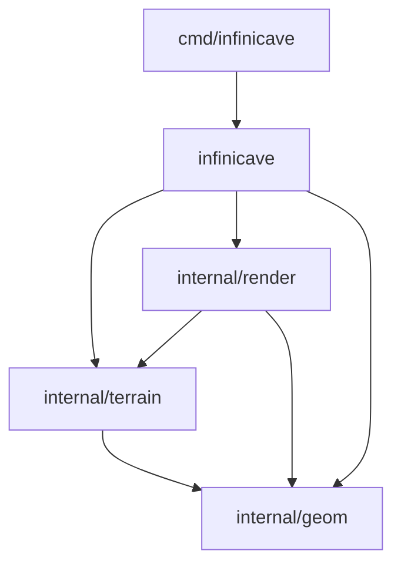

# Code navigation

Import `github.com/razzie/ebiten-infinicave` to use the library. The root package
owns the public API and coordinates generation, rendering, queries, and edits.
Implementation packages live under `internal/`, so applications cannot import
them directly.

| Area | Start here | Responsibility |
| --- | --- | --- |
| Configuration and scene lifecycle | `config.go`, `scene.go` | Validate settings; create, update, reset, draw, and close scenes |
| Public geometry | `geometry.go`, `section.go`, `collision.go`, `orientation.go`, `carve.go` | Expose types and entry points with the existing import path |
| Streaming | `world.go`, `world_stream.go` | Request sections, retain CPU results, publish terrain, budget GPU uploads, and evict distant sections |
| World composition | `world_render.go`, `carve_render.go` | Draw cached layers and refresh images after edits |
| Queries and identity | `query.go`, `query_index.go` | Track loaded coverage, formation and guide IDs, aliases, and revisions |
| Geometry algorithms | `internal/geom/` | Vectors, polygon clipping and triangulation, and ray/segment intersections |
| Terrain and vegetation | `internal/terrain/` | Deterministic section generation, guides, Voronoi rock, lighting, vines, mushrooms, collision topology, and geometry edits |
| Meshes and effects | `internal/render/` | Prepare meshes, scale raster coordinates, batch draws, render effects, and manage their GPU resources |
| Viewer | `cmd/infinicave/` | Parse flags, manage the camera and input, draw UI and hover effects, and export PNGs |

## Dependencies

`geom` and `terrain` have no Ebitengine dependency. Terrain retains the colors,
heights, normals, and topology needed to prepare render meshes. `render` consumes
that data and rendering settings; it never imports the root package or reaches
into a Scene. The background pass receives a narrow drawing interface for the
current cached terrain and foreground silhouette.

Generation and geometry edits stay together because rocks, guides, and plants
share topology and placement rules. Cross-section identity, availability, and
persistent runtime cuts belong to the root, where the world cache is owned.

## Ownership and execution

The section worker owns its builder, random streams, guide cache, and reusable
vine fields. It publishes immutable foreground geometry before generating
vegetation or preparing meshes. The game goroutine receives that early geometry
and invokes the collision callback. Final vegetation is attached to a separate
geometry value so it cannot mutate already published data.

Mesh preparation uses CPU data, even though vertices use Ebitengine types. GPU
images and shaders are created, uploaded, drawn, resized, and released on the game
goroutine. Upload budgets and cache publication live in `world_stream.go`.
Carving replaces geometry, updates the query index, and refreshes affected images;
stored cuts are replayed when sections regenerate. Resizing reuses CPU meshes.

Synchronous generation uses `terrain.GenerationOptions`, populated by the public
`GenerateSectionWithConfig` entry point after validating the full configuration.
Its collision callback runs on the calling goroutine.

## Tests and public compatibility

Tests live in the package that owns the behavior and use the corresponding
source filename (`coordinates.go` / `coordinates_test.go`, for example).
Files that cover several owners are split between those owners.

Scene configuration and effect lifecycle tests belong in root `scene_test.go`,
including fog, background, and bat enablement, updates, reset, and close.
Independent effect and mesh behavior belongs in `internal/render/`. Streaming
and GPU upload integration tests belong in root `world_test.go` and
`world_stream_test.go`; public section generation belongs in `section_test.go`.
Terrain generation, caching, and geometry tests live beside their implementations
in `internal/terrain/`.

External API tests in `api_test.go` exercise the public import path. Shared fixture
helpers stay within their test package and use an area prefix so editor tabs are
easy to distinguish: root `scene_fixtures_test.go`,
`internal/render/render_fixtures_test.go`, and
`internal/terrain/terrain_fixtures_test.go`. Benchmarks use the owner's test file
or an owner-prefixed `*_bench_test.go` file. These API, fixture, and benchmark
files are the exceptions to matching source filenames.

Public geometry types are aliases to their implementation types. Exported names,
fields, methods, constants, and function signatures are preserved. Aliases do
change the defining package reported by reflection for moved types; code relying
on `reflect.Type.PkgPath()` or `%T` should account for that. Internal geometry
helpers are package functions so they do not become methods on aliased public
types.

Run `go test ./...` and `go vet ./...`. CPU geometry tests can also run separately
with `go test ./internal/geom ./internal/terrain`. Rendering and scene checks may
need a graphical environment. Fixed-seed exports in both orientations and the
existing generation/carving benchmarks provide behavior and cost comparisons.
